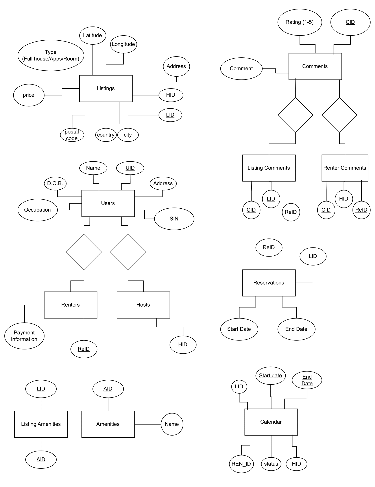

# C43 Project Report

Members: Arwin Fong, Eric Fan

## Description
This project aims to create a AirBnB-esque application using MySQL. This app would allow users to create listings, book residence at a listing, and/or leave comments on listings or renters.

### Conceptual problems
During designing, we found it hard to actually set constraints to query for and conditions to screen for invalid inputs. This is in part due to the size of the database, as we are not used to managing databases of this magnitude. As a result, we had to spend a lot of time considering the ways to set up queries and the application itself.

### Justification
Operations are mainly done by taking in user input, performing sanity checks on the input, then performing the query. This allows the app to provide informative feedback upon an invalid input with more flexibility, letting users correct their input much easier.

## Assumptions
In this project, we assume that:
- Users have knowledge of the IDs of other users and listings.
- When a user is deleted, all associated entries are deleted as well. For example, if a host is deleted, any related listings will be removed as well.

## ER Diagram

## Relation schema and keys
- Users(<ins>uid</ins>, name, dob, address, sin, occupation)
- Hosts(<ins>hid</ins>, uid)
- Renters(<ins>ren_id</ins>, uid)
- Listings(<ins>lid</ins>, price, latitude, longitude, type, hid, city, country, postal_code, address)
- Amenities(<ins>aid</ins>, name)
- Listing_Amenities(<ins>lid</ins>, <ins>aid</ins>)
- Reservations(<ins>res_id</ins>, ren_id, lid, start_date, end_date, availability)
- Calendar(<ins>lid</ins>, <ins>start_date</ins>, <ins>end_date</ins>, hid, ren_id, status)
- Comments(<ins>cid</ins>, rating, comment)
- Listing_Comments(<ins>lid</ins>, <ins>cid</ins>, ren_id)
- Renter_Comments(<ins>ren_id</ins>, <ins>cid</ins>, hid)

## DDL Statements
Refer to Schema.java in repository

## Source code
GitHub repository: https://github.com/arwinfong/C43-Project
Sample data is generated by Seed.java in repository